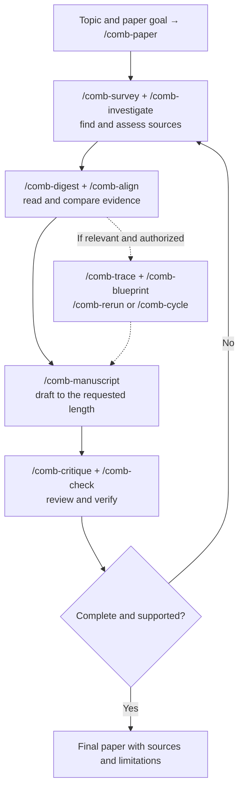

<p align="center">
  
</p>

<h1 align="center">ResearchComb</h1>

<p align="center"><strong>Find the paper. Follow the evidence.</strong></p>
<p align="center">Research workflows for Codex and Antigravity, right inside your AI chat.</p>

<p align="center">
  
</p>

<p align="center">
  <a href="#quick-start">Quick start</a> ·
  <a href="#workflows">Workflows</a> ·
  <a href="#prompt-examples">Prompt examples</a> ·
  <a href="#tested-in-codex">Test results</a> ·
  <a href="#faq">FAQ</a> ·
  <a href="#accuracy-responsibility-and-liability">Notice</a>
</p>

---

ResearchComb helps your AI assistant find literature, connect findings, inspect companion code, write manuscripts, and check claims against sources. Bring a question, a paper, or a draft; choose a workflow or let the general `researchcomb` skill guide the task.

**Free and open source. Twelve research workflows plus an update command. No ResearchComb server or API keys to configure.** It uses your host's existing browsing, file, execution, and scheduling tools.

## Quick start

### 1. Ask your AI to install it

Paste this into Codex or Antigravity with GitHub and local file access:

```text
Install ResearchComb version v0.5.22 at commit
43b79e5f9d12d3d99759f44debc68514deb7f14a from
https://github.com/diaznakh/ResearchComb for my account.
Check out that exact commit before copying or installing.
Use your native plugin installer if it accepts this
GitHub repository; otherwise copy every complete skill
folder under skills/, including supporting files, into
your user skills directory. Confirm researchcomb and all
thirteen comb-* commands are available. Do not execute
repository code during installation.
```

The host may ask for its normal approval to fetch GitHub or write to its skills directory. Use the instruction above to request installation; a bare link may only open the repository.

### 2. Start a new chat and give it a task

```text
Use comb-paper to write a 3,000–3,500-word review of
when retrieval-augmented generation improves factual
accuracy. Research the topic, compare primary studies,
draft the paper, critique it, verify claims and citations,
and save paper.md, evidence.json, and checks.md.
```

In **Codex**, type `$` and select a skill. In **Antigravity**, use its `/comb-*` slash command. Plain-language requests such as “Use comb-check to…” work in either host. A plugin may display the ResearchComb namespace with the skill name.

### Install manually

<details>
<summary><strong>Codex — CLI or desktop</strong></summary>

Register the GitHub source and install the plugin:

```sh
codex plugin marketplace add https://github.com/diaznakh/ResearchComb.git --ref 43b79e5f9d12d3d99759f44debc68514deb7f14a
codex plugin add researchcomb@researchcomb
```

Start a new chat after installation. If plugins are unavailable in your Codex surface, ask `$skill-installer` to install every complete folder under `skills/` from the pinned commit above.

</details>

<details>
<summary><strong>Antigravity — global skills, workspace skills, or CLI</strong></summary>

Ask the agent to copy every complete folder under `skills/`, preserving names and supporting files, into one of these locations:

| Scope | Location |
| --- | --- |
| All workspaces | `~/.gemini/config/skills/` |
| One workspace | `<workspace-root>/.agents/skills/` |

Check **Customizations → Installed → Skills & Rules** for `researchcomb` and the thirteen `comb-*` skills.

For a verifiable install, use the exact commit in the prompt above; a bare GitHub CLI install may fetch the moving branch.

</details>

<details>
<summary><strong>Update an existing installation</strong></summary>

For a GitHub marketplace installed in Codex:

```sh
codex plugin marketplace remove researchcomb
codex plugin marketplace add https://github.com/diaznakh/ResearchComb.git --ref VERIFIED_COMMIT_SHA
codex plugin add researchcomb@researchcomb
```

For copied Antigravity skills, replace the ResearchComb folders with the complete versions from the verified release commit's `skills/`. Preserve unrelated skills. Start a new chat after updating.

</details>

### Check for updates

Run [`comb-update`](skills/comb-update/SKILL.md) when you want to check the installed version against [GitHub](https://github.com/diaznakh/ResearchComb/blob/main/plugin.json). It reports whether a newer release exists and asks before updating. Research workflows make no update requests, so they do not add a GitHub lookup to each task. The check needs access to the public repository but no API key or separate ResearchComb service.

## Workflows

Use [`researchcomb`](skills/researchcomb/SKILL.md) for a task spanning several stages, or select the focused skill that fits your goal. The commands below use Antigravity's slash syntax; Codex exposes the same names through its skill selector.

| Your goal | Workflow | What you receive |
| --- | --- | --- |
| Write a paper from a topic | [`/comb-paper`](skills/comb-paper/SKILL.md) | A sourced paper, evidence record, and critique and verification findings |
| Find the literature | [`/comb-survey`](skills/comb-survey/SKILL.md) | A literature matrix, themes, gaps, and bibliography |
| Investigate a question | [`/comb-investigate`](skills/comb-investigate/SKILL.md) | A cited brief with a search strategy and verification record |
| Understand a source | [`/comb-digest`](skills/comb-digest/SKILL.md) | A focused summary with source locations and limitations |
| Compare findings | [`/comb-align`](skills/comb-align/SKILL.md) | Agreements, disagreements, and a grounded comparison matrix |
| Check a paper's code | [`/comb-trace`](skills/comb-trace/SKILL.md) | Claim-to-code findings and reproducibility gaps |
| Plan an implementation | [`/comb-blueprint`](skills/comb-blueprint/SKILL.md) | Ranked options and a concrete technical plan |
| Write a manuscript | [`/comb-manuscript`](skills/comb-manuscript/SKILL.md) | A sourced draft with a checked length target |
| Challenge the reasoning | [`/comb-critique`](skills/comb-critique/SKILL.md) | Severity-graded findings and a revision plan |
| Verify claims and citations | [`/comb-check`](skills/comb-check/SKILL.md) | A correction table with evidence and unresolved statuses |
| Try measured improvements | [`/comb-cycle`](skills/comb-cycle/SKILL.md) | A bounded experiment ledger and the best measured configuration |
| Reproduce a result | [`/comb-rerun`](skills/comb-rerun/SKILL.md) | Expected-versus-observed results with commands and deviations |
| Check for an update | [`/comb-update`](skills/comb-update/SKILL.md) | Installed and latest versions, with the right update step |

## From a topic to a research paper

Use `/comb-paper` for the complete workflow in one request. The chart shows the stages it follows; the table above links to each focused command.



`/comb-paper` keeps one [evidence record](skills/researchcomb/references/evidence-record.md) throughout. For open-ended live research, it checks all eleven scholarly search sources and follows review bibliographies, references, and forward or related-paper trails until a new pass finds no relevant leads within the stated scope. Five papers is only the discovery floor. It skips live search for a supplied-only corpus and skips the optional branch for a literature review. Experiments require authorization. It checks the requested word range and material claims before calling the paper complete; if evidence is insufficient, it labels the draft partial.

## A citation check in practice

In our [citation regression fixture](tests/fixtures/citation-draft.md), a draft uses a real DOI to claim that FeNi and NiPt are equally selective for producing propylene. `comb-check` reads the underlying evidence and returns:

| Check | Finding |
| --- | --- |
| Source identity | The DOI belongs to Gomez et al. (2018); the draft gives another paper's author and year. |
| Claim support | Under the studied conditions, FeNi favors propylene while NiPt favors dry reforming. |
| Revision | Correct the citation identity and describe the distinct catalyst pathways. |

The supporting source is the [Nature Communications paper](https://www.nature.com/articles/s41467-018-03793-w). This is a recorded test outcome. A resolving DOI identifies a source; checking the source determines whether it supports the nearby claim.

## How it works

1. **Frame the task.** Set the question, scope, output, and any execution budget.
2. **Gather evidence.** Read public research pages or supplied sources and record what was accessible.
3. **Carry the record forward.** Reuse source and claim IDs across comparisons, drafts, and reviews.
4. **Challenge and check.** Examine methodology, attribution, numbers, and source-to-claim support.
5. **Deliver with limits visible.** Report the result, measured completion checks, and remaining unknowns.

The [shared evidence record](skills/researchcomb/references/evidence-record.md) keeps bibliographic identity, link access, and claim support separate. Claims can be **supported**, **qualified**, **contradicted**, **unsupported**, or **unverified**. A substantial task can save the record as `evidence.json`; a narrow lookup can use a compact table in context.

For open-ended live academic searches and manuscripts with a requested word range, the installed skills instruct the host to run a local [completion checker](skills/researchcomb/scripts/check_completion.py). It flags missing broad-source attempts or fallbacks, fewer than five distinct discovered papers with titles and DOI/URL identifiers, empty or duplicate paper records, and drafts outside the requested word range (excluding References, Bibliography, or Sources sections). The `paper-search` mode also requires all eleven scholarly source attempts, screened citation trails, and a final search pass with no new relevant leads. Hosts without direct browsing can record that limitation and use source-specific web-search fallbacks. The five-paper floor does not apply to supplied-only or narrow searches. A [local safe fetcher](skills/researchcomb/scripts/safe_fetch.py) checks DNS addresses and redirects before retrieving discovered links when Python and network access are available. Both scripts use Python's standard library, with no ResearchComb server or API key. A host can skip them, and the completion checker cannot verify that a logged browser call happened, that all relevant leads were logged, or that a citation supports a claim; inspect the host tool log and use `comb-check` for those judgments.

### Paper and topic search sources

The [shared search guide](skills/researchcomb/references/search-sources.md) includes **Google Scholar** and **ResearchGate**, alongside Crossref, OpenAlex, Semantic Scholar, PubMed, Europe PMC, and preprint repositories. It also covers GitHub and Hugging Face when code or datasets matter, and official primary websites for broader topics.

- **Google Scholar:** topic, title, and author searches; citation trails and alternative paper versions.
- **ResearchGate:** publication and researcher discovery, with public paper copies where available.

For an open-ended academic topic, ResearchComb directs the host to attempt Google Scholar, ResearchGate, Crossref, OpenAlex, and Semantic Scholar through their own search pages. `comb-paper` also attempts PubMed, Europe PMC, alphaXiv, arXiv, bioRxiv, and medRxiv. If a site's own search is unavailable, it directs a separate general web query such as `battery recycling site:researchgate.net/publication` for each source. Its source table should record direct attempts and the exact fallback queries separately. A `site:` query finds pages indexed by a general search engine; it does not search the site's complete index. Narrow lookups and user-limited source sets stay within the requested scope. ResearchComb uses the host's existing browser and has no separate search index or API integration. The host model may still skip or misreport searches, so check its tool history when complete coverage matters.

```text
Use comb-survey to find papers on battery recycling.
Search Google Scholar and ResearchGate alongside other
relevant sources. If a site cannot be opened, run a
separate web query using its site: domain suffix. Record
direct searches and fallback queries separately,
deduplicate papers, and verify findings against the
underlying papers or abstracts before citing them.
```

## Prompt examples

Expand a workflow and copy its prompt. Replace filenames, topics, folders, and environment choices with your own.

<details>
<summary><strong>Complete research paper</strong> · <code>comb-paper</code></summary>

```text
Use comb-paper to write a 3,000–3,500-word literature
review on CO2-assisted propane dehydrogenation. Search
primary studies, record what you could actually read,
compare catalyst pathways, and write the paper in
sections. Then critique the draft and verify its claims
and citations. Save paper.md, evidence.json, and
checks.md. If evidence is insufficient, label the paper
partial and name the specific gaps.
```

</details>

<details>
<summary><strong>General research</strong> · <code>researchcomb</code></summary>

```text
Use ResearchComb to research when retrieval-augmented
generation improves factual accuracy and when it fails.
Find primary sources, compare their findings, and
produce a cited brief with an evidence record and
unresolved questions.
```

</details>

<details>
<summary><strong>Implementation consistency</strong> · <code>comb-trace</code></summary>

```text
Use comb-trace to audit paper.pdf against its companion
repository in ./paper-code. Check data splits,
hyperparameters, and evaluation metrics. Cite paper
sections and code locations, grade mismatches by
severity, and inspect without running the code.
```

</details>

<details>
<summary><strong>Experiment loop</strong> · <code>comb-cycle</code></summary>

```text
Use comb-cycle to optimize validation F1 in ./benchmark
using my existing local .venv. You may run the benchmark
and change only the decision threshold. Keep the
validation data fixed, use at most three trials and
fifteen minutes, preserve the original configuration,
and record which measured changes you keep or reject.
```

</details>

<details>
<summary><strong>Source comparison</strong> · <code>comb-align</code></summary>

```text
Use comb-align to compare paper-a.pdf and paper-b.pdf.
Build a cited matrix covering study design, datasets,
baselines, results, and limitations. Explain agreements
and disagreements, and identify results that cannot be
compared directly.
```

</details>

<details>
<summary><strong>Deep investigation</strong> · <code>comb-investigate</code></summary>

```text
Use comb-investigate to examine whether CO2-assisted
propane dehydrogenation can reduce emissions under
industrial conditions. Find evidence supporting and
challenging the claim, separate laboratory results from
life-cycle estimates, and save a research brief and
evidence.json.
```

</details>

<details>
<summary><strong>Manuscript writing</strong> · <code>comb-manuscript</code></summary>

```text
Use comb-manuscript to turn findings.md and
evidence.json into a 6,000–6,500-word review, excluding
the bibliography. Include an abstract, introduction,
thematic comparison, limitations, research priorities,
and conclusion. Preserve source IDs, use linked
references, save manuscript.md, and report its measured
word count.
```

</details>

<details>
<summary><strong>Literature survey</strong> · <code>comb-survey</code></summary>

```text
Use comb-survey to review research on CO2-assisted
propane dehydrogenation published during the past five
years. Record search terms and screening criteria,
distinguish primary studies from reviews and preprints,
and deliver a literature matrix, thematic synthesis,
gaps, and linked bibliography.
```

</details>

<details>
<summary><strong>Implementation planning</strong> · <code>comb-blueprint</code></summary>

```text
Use comb-blueprint to rank practical methods for
searching my local document collection on a CPU-only
laptop with 8 GB RAM. Support the options with papers,
code, and documentation. Give prerequisites, resource
estimates, evaluation plans, and failure points. Produce
a plan without installing or executing anything.
```

</details>

<details>
<summary><strong>Result reproduction</strong> · <code>comb-rerun</code></summary>

```text
Use comb-rerun to reproduce the accuracy in Table 2 of
paper.pdf using ./paper-code, ./data, and my existing
local .venv. Local execution is authorized; preserve the
original code and data and do not install dependencies.
Record the protocol, commands, expected and observed
results, and deviations. Report whether the result
reproduces within one percentage point.
```

</details>

<details>
<summary><strong>Research critique</strong> · <code>comb-critique</code></summary>

```text
Use comb-critique to review draft.md with evidence.json.
Check methods, controls, baselines, uncertainty, and
whether the conclusions follow from the evidence. Give
critical, major, and minor findings with source
locations and a prioritized revision plan. Leave the
draft unchanged.
```

</details>

<details>
<summary><strong>Citation and claim verification</strong> · <code>comb-check</code></summary>

```text
Use comb-check to verify draft.md against evidence.json
and the underlying sources. Check citation identities,
numerical claims, quotations, and attribution. Return a
correction table and updated verification statuses,
distinguish inaccessible sources from broken links, and
leave the draft unchanged.
```

</details>

<details>
<summary><strong>Source summary</strong> · <code>comb-digest</code></summary>

```text
Use comb-digest to summarize paper.pdf in about 300
words. Cover its question, method, main findings,
important numerical conditions, and limitations, with
page or section references. State whether you inspected
the full text or only part of it.
```

</details>

<details>
<summary><strong>Update check</strong> · <code>comb-update</code></summary>

```text
Use comb-update to check whether my installed ResearchComb
version is current. If an update is available, show me the
right step for this AI client and ask before installing it.
```

</details>

## Tested in Codex

Earlier cases were recorded on **8 October 2026**, using native Codex runs and the host's existing tools. The `/comb-paper` case was run on **9 October 2026**:

| Check | Recorded result |
| --- | --- |
| Earlier focused workflow cases | **11 / 11 passed** |
| One-request `/comb-paper` case | **567 measured body words** within the requested 400–600 range; source IDs and critique and verification records preserved |
| Earlier general command discovery and routing | **Passed** — twelve skills discovered at that time and four requests routed |
| Local checker tests | **4 / 4 passed** |
| Long manuscript case | **6,201 measured body words**, within the requested range |
| Experiment loop | Improvement kept, regression rejected, two-trial budget respected |
| Reproduction case | A mismatched claimed result correctly reported as not reproduced |

Coverage is one representative Codex case per research workflow. Eight cases use local synthetic fixtures; the initial survey and citation checks use real public paper sources. Some publisher text was inaccessible and remained labelled as abstract or excerpt evidence. Antigravity skill installation was checked; its behavioral tests remain unverified.

[Read the results and limits](tests/RESULTS.md) · [Run the regression checks](tests/README.md)

## FAQ

<details>
<summary><strong>Do I need a server, API key, or extra account?</strong></summary>

ResearchComb is an instruction-based skill bundle. It has no bundled server or API client and requires no ResearchComb account. Your AI host's normal access and usage limits still apply.

</details>

<details>
<summary><strong>Can it work offline?</strong></summary>

It can use supplied local papers, reports, code, and data through the host's existing tools. Finding new papers and checking public links requires browsing. It records missing access rather than inventing source content.

</details>

<details>
<summary><strong>Does it guarantee every claim is correct?</strong></summary>

It guides verification and records the evidence behind conclusions. Read the verification summary: missing sources, limited text access, and unchecked claims stay visible. Representative passing tests do not establish accuracy for every research task.

</details>

<details>
<summary><strong>Can it run experiments or monitor a topic?</strong></summary>

Experiments need available local execution tools and an authorized environment. Third-party research code runs only in an isolated local environment with access limited to task files, no user secrets, and network access only when needed and authorized. Recurring monitoring needs the host's scheduler and a user request. ResearchComb does not provision cloud compute or paid services; it provides a plan when execution or scheduling is unavailable.

</details>

## Inside the repository

- [`skills/`](skills/) — the general skill, twelve research workflows, the update command, and shared evidence guidance.
- [`plugin.json`](plugin.json) — portable package and Codex presentation metadata.
- [`skills/researchcomb/VERSION`](skills/researchcomb/VERSION) — installed version for skills copied without the plugin manifest.
- [Codex marketplace](.agents/plugins/marketplace.json) — GitHub installation source.
- [`tests/`](tests/) — fixtures, local checks, and recorded native Codex outcomes.
- [`assets/`](assets/) — the ResearchComb logo and local README badges.

## License

[MIT](LICENSE). Free to use, modify, and share under the license terms.

## Accuracy, responsibility, and liability

ResearchComb assists with research; its outputs may be incorrect, incomplete, or outdated. AI models may invent or misattribute citations, misinterpret sources, overlook conflicting evidence, or produce faulty code and experimental conclusions. Citation checks, evidence records, and passing tests do not guarantee accuracy, completeness, or reproducibility.

Users are responsible for independently checking sources, citations, calculations, code, and conclusions before publishing, executing, or relying on an output. ResearchComb does not replace qualified professional advice or the user's own judgment. Review the host AI's permissions and any proposed commands before authorizing execution.

ResearchComb is provided **"as is," without warranty**, under the [MIT License](LICENSE). To the extent permitted by applicable law, the authors and copyright holders disclaim warranties and liability for claims, damages, or other losses arising from the software or its use, including reliance on generated outputs. This notice summarizes the license; it does not replace or expand its terms or exclude liability that cannot lawfully be excluded.
